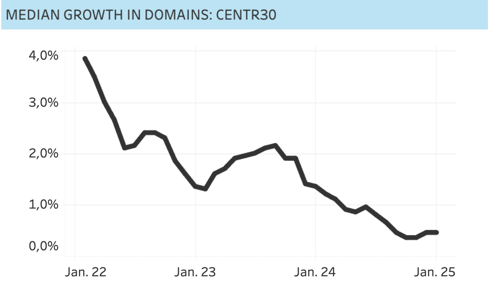
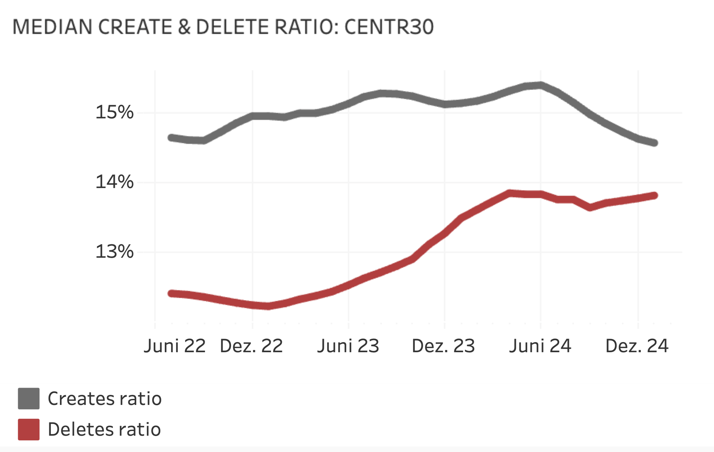
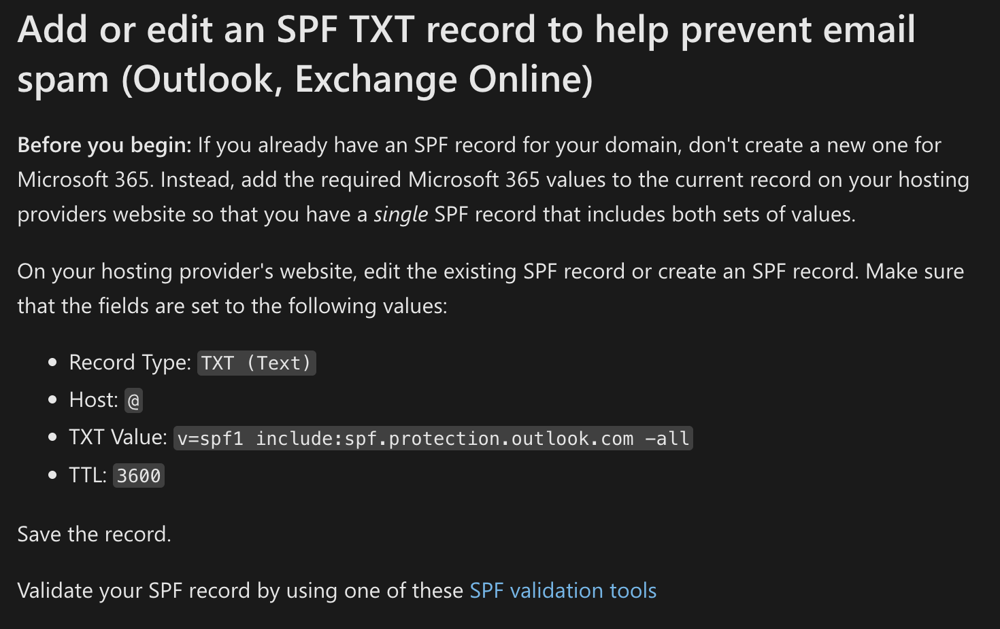
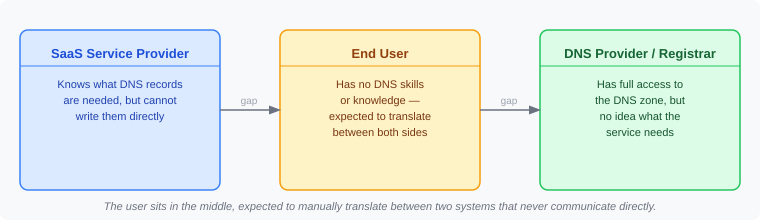

# 01 — The Problem Domain Connect Solves

*Part of the [Domain Connect Knowledge Base](./00_MASTER.md)*

---

## The Declining Domain Market

Domain registrations are not growing the way they used to. CENTR statistics for the CENTR30 registries show median domain growth declining from ~4% in early 2022 to barely above 0% by early 2025. This is not a cyclical blip — it reflects a structural problem with how domains are being used (or not used) after registration.

The CENTR Domain Renewal Study 2024 reveals the underlying mechanism:

| Domain usage level | Renewal rate |
|--------------------|-------------|
| No content | ~70% |
| Low content | ~78% |
| High content | ~90% |

*Median domain growth across CENTR30 registries, declining from ~4% (Jan 2022) to near 0% (Jan 2025). Source: CENTR / ROW 2025 presentation.*

*Deletes ratio (red) narrowing the gap with creates ratio (grey), reflecting structural pressure on domain base growth. Source: CENTR Jamboree 2025.*

**The business implication:** Getting domains into active use is not a nice-to-have for registries and registrars — it is the single most important lever for renewal revenue. A domain sitting unused after registration is a customer walking out the door at renewal time.

---

## What Does "Getting a Domain Into Use" Require?

Five things must happen for a registered domain to become an actively used domain:

1. **Idea and use-case** — the user has a reason to have a domain
2. **Domain registration** — the domain is purchased
3. **Service selection** — the user picks a service (e-commerce, email, website builder, etc.)
4. **Content creation** — the user builds something on the domain
5. **DNS configuration** — the domain is pointed at the chosen service

Steps 1–4 are largely solved. Step 5 is where the entire domain value chain repeatedly breaks down.

---

## The DNS Configuration Problem

DNS configuration is a hidden but catastrophic failure point in the domain user journey. Consider what Microsoft requires to configure a custom domain for Microsoft 365 email:

- **6-step setup process**
- **7 to 15 DNS records** to be created manually
- **16 help sites** maintained by Microsoft (10 of them registrar-specific, because every registrar's DNS interface is different)
- **40 minutes** of training needed to reliably complete the process

*One of the 16 Microsoft 365 DNS help articles — each DNS record requires its own instructions, and the instructions differ per registrar.*

The result? **Approximately 50% of users who attempt manual DNS configuration fail and abandon the process.**

These are not uninterested visitors — these are paying customers who have already registered a domain and signed up for a service. They are motivated. They fail because the technical complexity is genuinely beyond most non-expert users.

This pattern repeats across Google Workspace, Shopify, Squarespace, Apple iCloud+, and virtually every SaaS platform that allows users to bring their own domain.

---

## The Structural Root Cause

The problem is architectural. Three parties are involved, and none of them communicate directly with each other:

The service provider knows what DNS configuration is needed for their service, but they cannot access the user's DNS zone. The DNS provider has full access to the zone, but has no idea what the service provider needs. The user sits in the middle, expected to translate between the two — without the knowledge to do so.

Every SaaS provider that supports custom domains has had to solve this by publishing help documentation. This approach has three fundamental flaws:

1. **It requires the user to understand DNS** — most don't
2. **It requires 10+ registrar-specific variants** — because every registrar's UI is different
3. **It breaks every time either side changes anything** — new registrar UI, new DNS record format, new service infrastructure

---

## Why This Matters for the Domain Industry

Domain growth stagnation is not primarily a demand problem. People want to have online presences and use their own domain names. The demand is there. The conversion from registered domain to active domain is where value is lost.

The CENTR renewal data makes the math clear: moving a customer from "no content" to "high content" improves renewal probability by approximately 20 percentage points. DNS configuration friction is one of the primary barriers between registration and active use. Removing it has a direct, measurable impact on renewal rates.

---

## Key Takeaway

> **The domain industry has spent decades perfecting registration, resolution, and security infrastructure — but left a critical gap at the moment of first use. DNS configuration is where half of activated customers fail. That is the problem Domain Connect was built to solve.**

---

*Next: [02 — What Is Domain Connect](./02_What_Is_Domain_Connect.md)*
