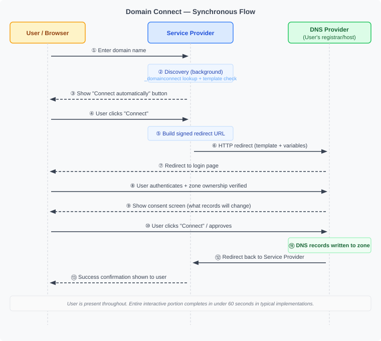
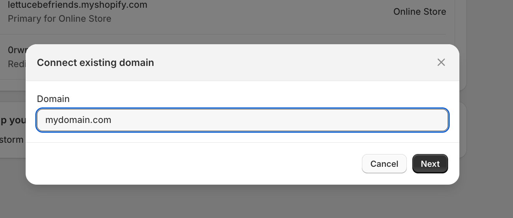
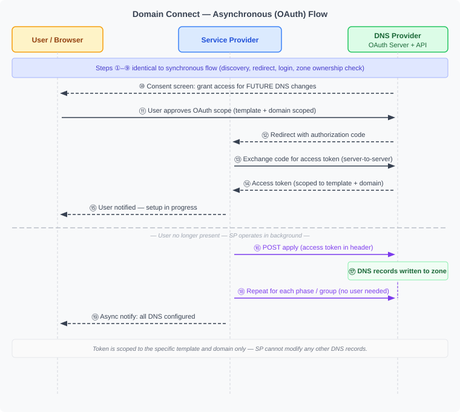
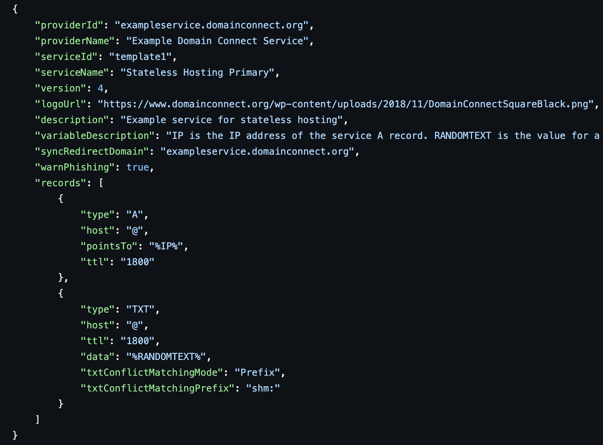
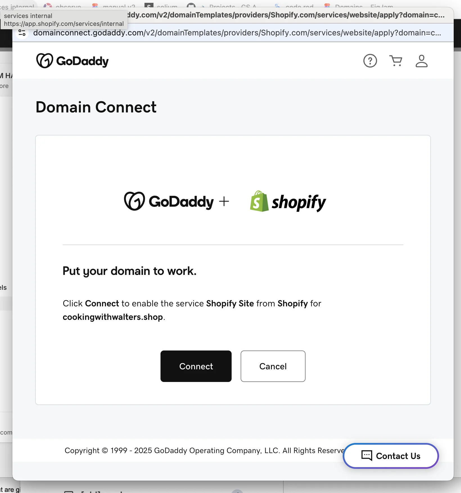
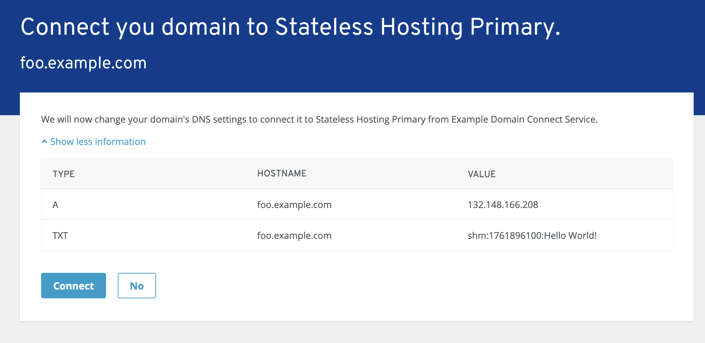
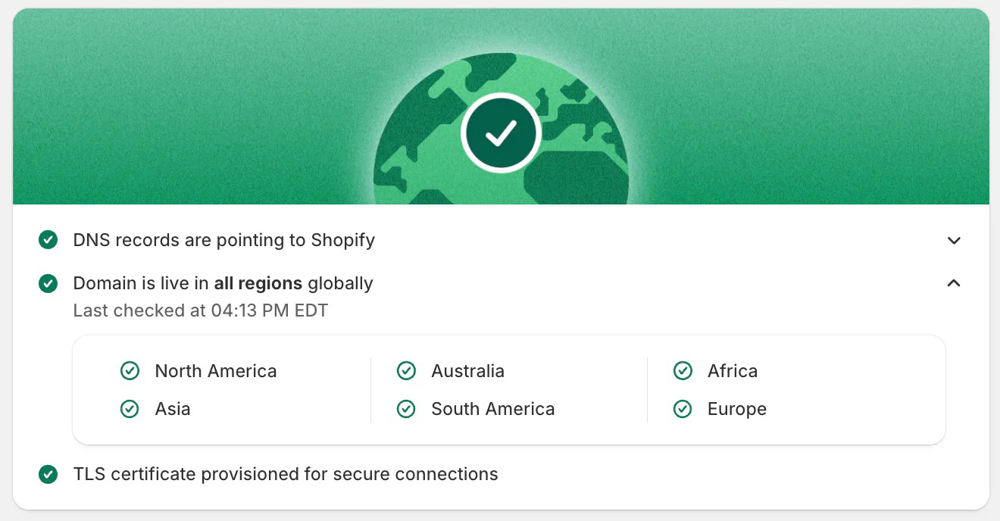

# 03 — How Domain Connect Works

*Part of the [Domain Connect Knowledge Base](./00_MASTER.md)*

---

## Overview

Domain Connect operates through a structured sequence involving three parties — the Service Provider (SP), the DNS Provider (DNSP), and the user. Before any user flow begins, the Service Provider and DNS Provider must establish a relationship and exchange a template. This is the foundation on which everything else rests.

```
Phase 0 (one-time setup, out-of-band):
  Service Provider ──[template]──► DNS Provider
                    [trust established]

Phase 1 (per-user, automated):
  User → Service Provider → DNS Provider → DNS zone updated
```

---

## Phase 0: Template Onboarding (Out-of-Band)

Before any user can benefit from Domain Connect, the Service Provider and DNS Provider must collaborate offline:

1. **Service Provider creates a template** — a JSON file defining exactly what DNS records their service needs
2. **Service Provider provides the template** to the DNS Provider (via email, portal, or direct contact)
3. **DNS Provider reviews and vets the template** — checking that it does what it claims, not more
4. **DNS Provider deploys the template** in their Domain Connect infrastructure
5. **Trust is established** — the DNS Provider has vouched for this template

This vetting process is intentional and security-critical: it means a malicious actor cannot create a fake template and push arbitrary DNS changes. Only pre-approved templates can be applied.

---

## Phase 1: Discovery

When a user enters their domain name in a Service Provider's interface, the Service Provider automatically checks whether the domain's DNS Provider supports Domain Connect.

**Step 1 — DNS Lookup for `_domainconnect` record**

The SP looks up the TXT record at `_domainconnect.<domain>` (e.g., `_domainconnect.example.com`). If this record exists, it contains a pointer to the DNS Provider's Domain Connect API endpoint. Its presence signals: "this domain's DNS provider speaks Domain Connect."

**Step 2 — Fetch DNS Provider Settings**

The SP calls the DNS Provider's settings endpoint (a JSON document called the "discovery document") to learn:

- The base URL for the Domain Connect API
- Which protocol features are supported
- Any additional configuration details

**Step 3 — Check Template Support**

The SP queries the DNS Provider's API to confirm that its specific template is deployed and supported. If the answer is yes, the user is offered the "connect automatically" button. If not, the SP falls back to showing manual DNS instructions.


**What the user sees:** Nothing. This entire discovery process happens invisibly in the background, typically in less than a second.

---

## Phase 1: The Synchronous Flow (One-Time Setup)

This is the most common flow — used for one-off service connections where the user is present.



The screenshots below show a real-world example: connecting a custom domain to Shopify via GoDaddy as the DNS Provider.



*Step 1: The user enters their domain name in Shopify's interface.*


*After discovery: Shopify detects that GoDaddy supports Domain Connect and offers one-click setup alongside the manual option.*


*The user is redirected to GoDaddy to authenticate — the DNS Provider controls this step entirely.*

**Key security checkpoints in this flow:**

- The DNS Provider authenticates the user — no one else can approve changes to their zone
- The URL may be signed with a cryptographic signature, verified by the DNS Provider against public keys published in DNS — preventing URL tampering
- Changes are strictly limited to what the pre-approved template specifies

**What "synchronous" means:** The user is present throughout, and their session ends when the setup is complete. It does not mean DNS propagation is instant — the DNS records may still take time to propagate through the DNS network.

---

## Phase 1: The Asynchronous Flow (OAuth-Based)

Some services need to make DNS changes over time, or in multiple steps, without requiring the user to be present each time. The asynchronous flow solves this using OAuth 2.0.

**When it's used:**

- Multi-step DNS configuration (e.g., first verify ownership via TXT, then configure MX records)
- Services that need to update DNS records as their infrastructure changes (e.g., dynamic DNS, changing IP addresses)
- Long-running service integrations where the SP needs ongoing DNS management capability

**How it differs from the synchronous flow:**

Steps 1–14 are identical to the synchronous flow (discovery, authentication, domain verification). The divergence begins at the consent step:



**OAuth token scope:** Tokens are scoped precisely to the specific template and the resource records it covers. A token granted for "Shopify Website" cannot be used to modify MX records or any other records outside the template's scope. Only subdomain scoping has some flexibility (none, single, multiple, or any).

---

## Template Structure

A template is a JSON document with the following components. The screenshot below shows a complete minimal example from the IETF specification:



*A complete minimal template: identification fields, two DNS records (A + TXT), a variable (`%IP%`, `%RANDOMTEXT%`), conflict resolution mode, and signing configuration.*

### Identification
```json
{
  "providerId": "shopify.com",
  "providerName": "Shopify",
  "serviceId": "website",
  "serviceName": "Shopify Site",
  "version": 4,
  "logoUrl": "https://...",
  "description": "Connects your domain to your Shopify store"
}
```

### Resource Records
The core of the template — defines which DNS records to create:

```json
"records": [
  {
    "type": "A",
    "host": "@",
    "pointsTo": "%IP%",
    "ttl": "1800"
  },
  {
    "type": "TXT",
    "host": "@",
    "data": "%RANDOMTEXT%",
    "ttl": "1800",
    "txtConflictMatchingMode": "Prefix",
    "txtConflictMatchingPrefix": "shm:"
  }
]
```

### Variables
Dynamic values filled in at runtime by the Service Provider and passed in the redirect URL:
- `%IP%` — the IP address of the service's server
- `%RANDOMTEXT%` — a verification token for domain ownership checks

### Conflict Resolution Controls
Instructions for how to handle existing DNS records:
- `txtConflictMatchingMode`: how to detect conflicts in TXT records (`None`, `All`, `Prefix`)
- `essential`: whether a record is `Always` required or only `OnApply`
- `multiInstance`: whether multiple instances of a record can coexist

### Template Groups
Records can be grouped with a `groupId`, allowing a service to apply DNS configuration in stages (e.g., first verify, then configure).

---

## The Redirect URL

The Service Provider sends the user to the DNS Provider via an HTTP redirect. The URL carries all the information needed to apply the template:

```
https://domainconnect.dnsprovider.example/sync/v2/domainTemplates
  /providers/shopify.com/services/website/apply
  ?domain=example.com
  &host=
  &IP=132.148.166.208
  &RANDOMTEXT=shm%3A1761896100%3AHello%20World
  &sig=<cryptographic_signature>
  &key=<key_identifier>
```

**Color-coded components:**

- DNS Provider's base URL (from discovery)
- Provider and template identifiers
- Standard parameters: domain, host
- Template variables: IP, RANDOMTEXT (service-specific)
- Optional cryptographic signature for URL integrity

---

## The Consent Screen

The DNS Provider presents a human-readable consent screen to the user before making any changes. The protocol does not mandate how this screen looks, but it must communicate:

- Which service is requesting the connection
- The specific domain being configured
- What DNS changes will be made (record type, hostname, value)
- Any conflicts with existing records

The screenshots below show two real consent screens — GoDaddy's production implementation (Shopify integration) and the reference implementation from the IETF specification:



*GoDaddy's consent screen: shows service name, domain being configured, and a single "Connect" button. The Service Provider cannot alter this UI.*



*Reference implementation consent screen: shows the exact DNS records that will be written (type, hostname, value) before the user approves.*

The user can always cancel. The DNS Provider controls this UI — the Service Provider cannot manipulate it beyond providing the service name and logo (which were vetted during template onboarding).

---

## After the Connection

Once the user approves and DNS records are written:



*Shopify's post-connection confirmation: DNS records verified as live across all regions.*

1. The DNS Provider redirects the user back to the Service Provider (or closes the popup)
2. The Service Provider may poll DNS to verify propagation
3. Propagation to authoritative servers may take additional time — this is normal DNS behavior
4. The Service Provider should not assume records are immediately resolvable; it should verify

---

## What Happens Under the Hood: Discovery Record Details

The `_domainconnect` DNS record is a TXT or CNAME record placed at the zone apex. For example:

```
_domainconnect.example.com. IN TXT "https://api.domaincontrol.com/v2"
```

This record:
- **Signals** that the DNS provider supports Domain Connect
- **Points** to the API base URL of the DNS Provider's Domain Connect service
- **Enables** zero-configuration discovery for any Service Provider

The `_domainconnect` DNS node name is registered with IANA (per RFC 8552) as part of the standardization process.

---

*Previous: [02 — What Is Domain Connect](./02_What_Is_Domain_Connect.md) | Next: [04 — Protocol Features Deep Dive](./04_Protocol_Features.md)*
