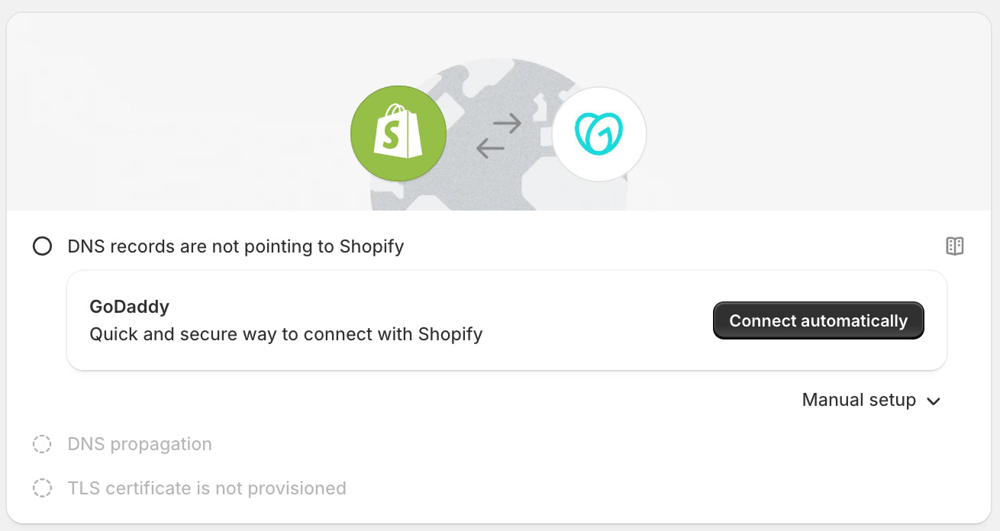

# 05 — Use Cases

*Part of the [Domain Connect Knowledge Base](./00_MASTER.md)*

---

## Overview

Domain Connect was designed for a specific problem: the gap between "domain registered" and "domain in active use." Its primary use case is service integration — connecting a user's domain to a third-party service. But the protocol's architecture creates opportunities well beyond that original use case.

---

## Primary Use Case: Service Integration

### Website Builders and E-Commerce

**Scenario:** A user has registered a domain and now wants to use it with a website builder or online store.

**Without Domain Connect:** The user receives instructions listing 5–15 DNS records to create manually across two different systems. Approximately half fail to complete this process.

**With Domain Connect:** The user types their domain into the service's interface. The service detects that the DNS provider supports Domain Connect. The user clicks "Connect," logs into their DNS provider, sees a plain-language description of what will be configured, approves, and is done.



*Real-world example: Shopify detects GoDaddy Domain Connect support and surfaces a one-click setup button. "Manual setup" remains available as fallback.*

**Real-world examples:** Shopify, Squarespace, Weebly, and other website builders have deployed Domain Connect templates with major DNS providers.

**DNS records typically involved:** A or CNAME (to point the domain to the hosting platform), TXT (for ownership verification)

---

### Email Services

**Scenario:** A business wants to use a professional email service (e.g., Microsoft 365 or Google Workspace) with their custom domain.

**Without Domain Connect:** Microsoft 365 requires users to create 7–15 records across multiple types: MX (for mail routing), multiple TXT records (for SPF and domain ownership), CNAME records (for autodiscover and other services). Microsoft maintains 16 help articles, 10 of them registrar-specific, because each registrar's interface is different.

**With Domain Connect:** One click. The DNS provider applies all the required records in a single operation, using a pre-vetted template that includes proper SPF merging to avoid conflicts with existing email configuration.

**DNS records typically involved:** MX, TXT (SPF, DKIM, domain verification), CNAME (autodiscover, mail clients)

---

### Authentication and Security Services

**Scenario:** A service needs to establish trust for DKIM signing, set up BIMI (Brand Indicators for Message Identification), or configure STS policies.

**With Domain Connect:** Complex TXT records with precise syntax requirements can be applied reliably, without transcription errors that break DKIM validation.

**DNS records typically involved:** TXT (DKIM public keys, SPF entries, BIMI indicators), CNAME (for external key rotation services)

---

### CDN and Performance Services

**Scenario:** A user wants to route their traffic through a CDN or DDoS protection layer.

**With Domain Connect:** CNAME records for subdomains (e.g., `www`) can be configured with one click. The service defines the target CNAME in its template; the user approves.

**DNS records typically involved:** CNAME, A/AAAA, TXT (ownership verification)

---

### VoIP and Communication Services

**Scenario:** A business wants to configure SIP/VoIP service on their domain.

**With Domain Connect:** SRV records (which require correctly formatted priority, weight, and port fields) can be applied reliably through a pre-defined template.

**DNS records typically involved:** SRV, TXT

---

## Multi-Step Flows: Verification Then Configuration

Many services require a two-phase DNS configuration:
1. **Phase 1:** Prove domain ownership (TXT record)
2. **Phase 2:** Configure the actual service (MX, CNAME records)

Domain Connect's **template groups** (`groupId`) and the **asynchronous OAuth flow** are designed exactly for this pattern:

```
User approves once (OAuth flow)
  → Service Provider applies verification records (groupId=verification)
  → SP polls for verification success
  → SP applies service records (groupId=service)
  → User notified of completion
```

The user sees one consent screen; all subsequent steps happen automatically in the background.

---

## Extended Use Cases

These are valid Domain Connect applications that go beyond the original service-integration scenario, particularly relevant for registries and registrars.

### DNSSEC Bootstrapping

**Current state:** The standard DNSSEC bootstrapping mechanism (using CDS and CDNSKEY records, per RFC 8078) requires the registry to periodically poll DNS zones looking for records that signal a domain owner wants DNSSEC enabled. This creates delays and is inefficient at scale.

**Domain Connect application:** A DNS provider that has enabled DNSSEC for a zone could use a Domain Connect-like flow to signal DNSSEC readiness to the registry and provide DS records in real time. Instead of the registry polling, the DNS provider initiates an explicit, event-driven handshake.

**Benefit:** Real-time DNSSEC delegation without polling latency. Particularly valuable for TLDs with millions of zones.

---

### Automated Nameserver Changes

**Current state:** Moving a domain to a new DNS provider requires the user to navigate their registrar's control panel, manually enter new nameserver hostnames, and wait for registry propagation.

**Domain Connect application:** A DNS provider offering a nameserver migration service could define a template that, when applied, configures the new nameserver delegation. The registrar (acting as the DNS Provider in the Domain Connect flow) updates the NS delegation at the registry level — all in a single user-approved action.

**Benefit:** One-click nameserver migration with built-in verification.

---

### Sell-and-Configure Flow

**Current state:** Service providers that want users to use custom domains face a two-step problem: the user must first register a domain (somewhere), then configure it (somewhere else). These are separate flows with high drop-off between them.

**Domain Connect application:** A service provider (e.g., Shopify) partners with a registrar. When a user wants a custom domain on their store, the registrar registers the domain and Domain Connect immediately configures it — all without the user leaving the service provider's interface.

**Flow:**
```
User in Service Provider → selects domain → registrar registers it
  → Domain Connect applies DNS configuration
  → User sees their store live on their new domain
```

**Benefit:** Collapses a multi-day, multi-platform process into a single session. High potential for domain registration conversion.

---

## Out-of-Scope Use Cases

Understanding what Domain Connect is **not** designed for is as important as knowing what it does.

### CI/CD Pipelines and Automated DNS Management

Domain Connect requires a user to be present (for authentication and consent). It is not designed for headless, machine-to-machine DNS automation. For automated DNS management in DevOps contexts, use DNS provider APIs directly (e.g., Route 53, Cloudflare API, RFC 2136 dynamic DNS).

### Private and Enterprise DNS

Domain Connect requires publicly accessible API endpoints. Internal corporate DNS infrastructure, split-horizon DNS zones, and private DNS resolvers are not compatible with this assumption without significant additional engineering.

### Arbitrary DNS Zone Management

Domain Connect is not a general-purpose DNS management API. Every change is strictly constrained to what a pre-approved template allows. It cannot make arbitrary DNS edits, delete zones, or manage records outside the template scope.

### Domain Registration

Domain Connect configures DNS records for existing registered domains. It does not register domains. The sell-and-configure extended use case requires a separate domain registration step through normal registrar channels — Domain Connect handles only the post-registration DNS configuration.

---

## Use Case Summary

| Use Case | Flow | Status |
|----------|------|--------|
| Website builder / e-commerce | Synchronous | Core; widely deployed |
| Email service setup (M365, Google Workspace) | Synchronous | Core; widely deployed |
| Authentication / DKIM / SPF setup | Synchronous | Core |
| CDN / performance service | Synchronous | Core |
| VoIP / SRV-based services | Synchronous | Core |
| Multi-step (verify then configure) | Asynchronous | Core; requires OAuth implementation |
| Dynamic DNS (IP address changes) | Asynchronous | Core; requires OAuth implementation |
| DNSSEC bootstrapping | Extended | Proposed; not yet standardized |
| Nameserver migration | Extended | Proposed; requires registrar integration |
| Sell-and-configure | Extended | Proposed; requires registrar partnership |
| CI/CD automation | — | Out of scope |
| Private/enterprise DNS | — | Out of scope |
| Arbitrary zone management | — | Out of scope |

---

*Previous: [04 — Protocol Features](./04_Protocol_Features.md) | Next: [06 — Value by Audience](./06_Value_by_Audience.md)*
