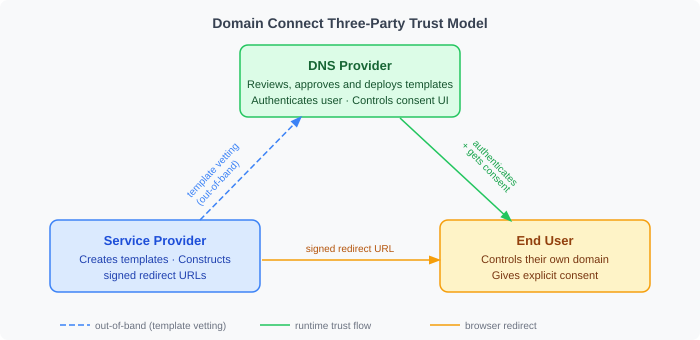

# 08 — Security Model

*Part of the [Domain Connect Knowledge Base](./00_MASTER.md)*

---

## Overview

Domain Connect is an authorization protocol operating on a sensitive resource: the DNS zone that controls where a user's domain points. The security model is therefore central to the protocol's design. This document describes the trust model, the security mechanisms, and the known security considerations that have emerged from IETF review.

---

## Trust Model



### The three-party trust hierarchy

Domain Connect establishes explicit trust relationships between three parties:

**DNS Provider trusts the template (not the Service Provider directly)**
The most important security property of Domain Connect is that the DNS Provider does not trust Service Providers at runtime. A Service Provider cannot push DNS changes to a user's zone simply by constructing a redirect URL. The DNS Provider only acts on templates that it has previously reviewed, approved, and deployed. If a template doesn't exist in the DNS Provider's system, the request is rejected.

This out-of-band vetting process is the foundation of the trust model: malicious actors cannot create new templates and push them to a DNS Provider without that provider's explicit review and approval.

**User trusts the DNS Provider**
The user's consent is obtained by their own DNS Provider — a party they already have a relationship with (they use them for DNS hosting). The consent screen is controlled entirely by the DNS Provider, not by the Service Provider. The Service Provider cannot manipulate what the user sees or bypass the consent step.


*The consent screen is rendered and controlled by GoDaddy (the DNS Provider). Shopify cannot alter its content or bypass it.*


*Reference implementation: the consent screen displays the exact DNS records that will be written, allowing informed user approval.*

**DNS Provider verifies user identity and zone ownership**
Before applying any template, the DNS Provider must authenticate the user and verify that the user controls the target zone. A user cannot apply DNS changes to a domain they don't own, even if they have a valid redirect URL.

### What this prevents

- **Unauthorized DNS changes:** A Service Provider cannot modify a user's DNS zone without going through the DNS Provider's consent flow
- **Fake templates:** An attacker cannot create a fraudulent template without the DNS Provider's prior approval
- **Cross-zone attacks:** A user cannot accidentally (or intentionally) apply a template to a domain they don't control
- **Scope creep:** Templates are strictly scoped — a template for "email setup" cannot also modify web hosting records

---

## Security Mechanisms

### 1. Cryptographic URL Signing

The redirect URL that a Service Provider sends to the user can be signed with a private key. The DNS Provider verifies the signature using the Service Provider's public key, which is published in DNS under a reserved subdomain.

**How it works:**
1. The Service Provider signs the redirect URL using a private key
2. The public key is published in DNS at `_dck<N>.<provider-domain>.` as a TXT record
3. The redirect URL includes a `sig=` parameter (the signature) and a `key=` parameter (the key identifier)
4. The DNS Provider fetches the public key from DNS and verifies the signature

**What this prevents:** A man-in-the-middle or a malicious actor cannot modify URL parameters (e.g., change `IP=198.51.100.1` to their own IP address) without invalidating the signature. Tampered URLs are rejected before any DNS changes are made.

**Template-level control:** The `syncPubKeyDomain` field in a template specifies the domain under which the Service Provider's signing keys are published. When this field is present, the DNS Provider MUST verify the signature. High-risk templates (those that affect where web traffic goes, such as A and CNAME records) should require signing.

**Public key DNS record format:**
```
_dck1.exampleservice.domainconnect.org. IN TXT "p=<base64-encoded-public-key>"
```

### 2. Template Pre-Approval (Vetting)

Every template must be reviewed and deployed by the DNS Provider before it can be used. This review process:
- Confirms the template does what it claims
- Confirms the records are consistent with the described service
- Establishes accountability (the DNS Provider has vouched for this template)
- Prevents arbitrary DNS manipulation by untrusted Service Providers

The vetting process is intentionally out-of-band and cannot be bypassed.

### 3. OAuth Token Scoping (Asynchronous Flow)

In the asynchronous flow, OAuth tokens are issued with precise scope. A token issued for a specific template is:
- Scoped to that specific template and the resource records it covers
- Cannot be used to modify records outside the template's scope
- Cannot be used for a different domain than the one authorized

Subdomain scoping is configurable: the scope can be limited to no subdomain, a specific subdomain, multiple subdomains, or any subdomain — giving the Service Provider and DNS Provider flexibility to match the service's actual needs.

### 4. User Authentication and Zone Ownership Verification

The DNS Provider must authenticate the user through its own authentication mechanism before processing any Domain Connect request. The user must prove they control the target zone. This means:
- A user cannot apply a template to someone else's domain
- Credentials are the DNS Provider's own (e.g., GoDaddy login) — not managed by the Service Provider
- The DNS Provider's authentication system is not in the Service Provider's control or visibility

### 5. `warnPhishing` Flag

Some templates contain variable-resolved values that could be set to point a domain at an attacker's server (e.g., an A record where the IP address is a template variable). If the Service Provider does not sign the URL, an attacker who intercepts and modifies the redirect URL could change the IP address to their own.

The `warnPhishing: true` flag in a template signals that the template contains such variables. DNS Providers SHOULD display a visible warning to users when this flag is set and URL signing is not present. This prompts users to verify they are on the correct Service Provider's website before approving.

---

## Known Security Considerations

The IETF review process surfaced several security considerations that are documented in the specification and worth understanding:

### Template variable injection

Template variables use `%VARIABLENAME%` notation for Service Provider-defined values, and `{variable}` notation for protocol-level URI templates. This intentional distinction prevents a situation where a misconfigured implementation accidentally injects Service Provider variables into protocol-level URL components, which could enable injection attacks.

**Mitigation:** The protocol defines two distinct notation systems. Implementations must not conflate them.

### Trust model complexity

The protocol's trust model involves multiple layers (DNS Provider trusts template, user trusts DNS Provider, DNS Provider verifies zone ownership). During IETF review, this complexity was flagged as a risk that implementations might misunderstand or shortcut.

**Mitigation:** The -01 draft includes a detailed, explicit trust model section. Implementers must read and understand it.

### URL signing as defense in depth, not primary security

URL signing prevents URL tampering but does not address all attack vectors. A Service Provider that has been compromised could still construct a valid signed URL pointing to an attacker's infrastructure. Signing proves the URL came from the key holder, not that the key holder is acting honestly.

**Mitigation:** URL signing is a defense-in-depth mechanism. The primary security boundary is the template vetting process: DNS Providers must only deploy templates from Service Providers they trust.

### Phishing risk for high-impact templates

Templates that configure A or CNAME records (which determine where web traffic goes) are higher risk than templates that configure DKIM keys (which only affect email authentication). If a user is tricked into approving a malicious A record change, their web traffic can be redirected.

**Mitigation:** The `warnPhishing` flag and URL signing requirement for high-risk templates. DNS Providers should require signing for templates with A, AAAA, or CNAME records.

### Ambiguity in variable notation (historical)

Earlier versions of the specification had some ambiguity in variable notation between the `{var}` and `%VAR%` systems. This was clarified in the -01 draft.

---

## What Domain Connect Does NOT Protect Against

Being clear about the protocol's security boundaries is important:

- **Compromised DNS Provider:** If the DNS Provider's systems are compromised, all bets are off. Domain Connect does not add security within a compromised DNS Provider.
- **Compromised Service Provider:** A Service Provider that signs and sends a malicious redirect URL with valid credentials cannot be stopped by the protocol alone — this requires the DNS Provider's template vetting.
- **DNS propagation spoofing:** Domain Connect configures DNS records but does not protect against DNS hijacking or cache poisoning (these are addressed by DNSSEC, which is a separate layer).
- **Social engineering:** If a user can be tricked into approving a consent screen they don't understand, Domain Connect's UI controls are insufficient. The consent screen must be clear and honest — this is a DNS Provider implementation quality concern.

---

## Security for Implementation Teams

**For DNS Provider implementers:**
- Require and verify URL signatures for all templates with A, AAAA, or CNAME records
- Do not accept templates without a thorough vetting process
- Display clear, honest consent screens — users must understand what they are approving
- Strictly enforce OAuth scope — a token must not grant access beyond what was explicitly consented
- Verify zone ownership before processing any apply request

**For Service Provider implementers:**
- Sign your redirect URLs — especially for templates that configure web traffic records
- Request only the minimum set of DNS records and variables your service needs (scope minimization)
- Do not pass sensitive values as URL parameters that could be intercepted; prefer short-lived signed tokens
- Validate that DNS changes have been applied before activating the service for the user

---

*Previous: [07 — Adoption & Ecosystem](./07_Adoption_and_Ecosystem.md) | Next: [09 — Getting Involved](./09_Getting_Involved.md)*
