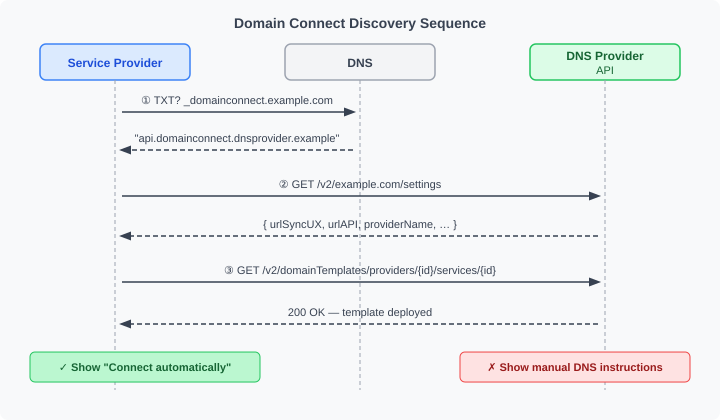
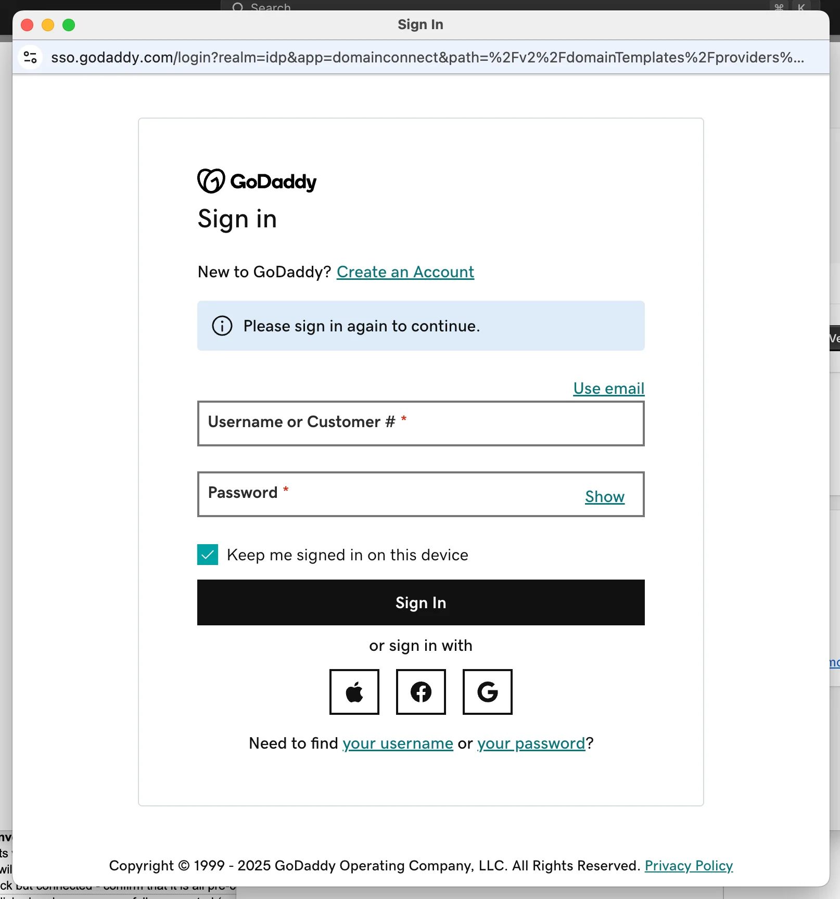

# 12 — Getting Started: DNS Provider

*Part of the [Domain Connect Knowledge Base](./00_MASTER.md)*

*Sources: [domainconnect.org/getting-started](https://www.domainconnect.org/getting-started/), [09 — Getting Involved](./09_Getting_Involved.md), [draft-ietf-dconn-domainconnect-01](https://datatracker.ietf.org/doc/draft-ietf-dconn-domainconnect/)*

---

## Who this document is for

You are a DNS provider or registrar — you host authoritative DNS zones for your customers' domains. This guide walks you through implementing Domain Connect so your customers can connect their domains to services like Microsoft 365, Google Workspace, or Shopify in one click, instead of manually entering DNS records.

For the business case and value proposition, see [06 — Value by Audience](./06_Value_by_Audience.md). For the full protocol specification, see [03 — How It Works](./03_How_It_Works.md) and [04 — Protocol Features](./04_Protocol_Features.md).

---

## Start with the synchronous flow

If you are new to Domain Connect, implement the **synchronous flow** first. It covers the vast majority of real-world use cases, is simpler to build, and is supported by all 120+ service providers with templates. You can add the asynchronous OAuth flow later if your customers need it.

---

## Step 1 — Implement DNS discovery

Discovery is how a Service Provider finds out that your DNS provider supports Domain Connect, and learns your API endpoints. It consists of three parts:



### 1a. `_domainconnect` TXT record

For each zone you host, respond to DNS queries for `_domainconnect.<domain>` with a TXT record containing your API base URL (authority + optional path, no scheme, no query or fragment).

Example record content:
```
api.domainconnect.yourdnsprovider.com
```

When a Service Provider prepends `https://` and appends `/v2/<domain>/settings`, this becomes the URL they call to get your settings document.

You do not need to store a TXT record in every zone. The DNS Provider simply needs to respond correctly to the query — this can be done at the DNS layer without per-zone data.

### 1b. Settings endpoint

Implement the JSON settings endpoint:

```
GET https://{your-api-base}/v2/{domain}/settings
```

Return a JSON document with at minimum:

```json
{
  "providerId": "yourdnsprovider.com",
  "providerName": "Your DNS Provider",
  "urlSyncUX": "https://connect.yourdnsprovider.com",
  "urlAPI": "https://api.yourdnsprovider.com",
  "nameServers": ["ns1.yourdnsprovider.com", "ns2.yourdnsprovider.com"]
}
```

Return `404` if you do not host the zone for the requested domain.

Optional fields: `providerDisplayName`, `urlAsyncUX` (async flow only), `urlControlPanel`, `width`, `height`.

### 1c. Template query endpoint

Implement the endpoint Service Providers use to check whether you have deployed their specific template:

```
GET {urlAPI}/v2/domainTemplates/providers/{providerId}/services/{serviceId}
```

Return `200` (with optional version or template JSON body) if the template is deployed. Return `404` if it is not.

These three endpoints are all unauthenticated — no user login is required to call them.

---

## Step 2 — Build the synchronous UX flow

This is the browser-facing flow the user goes through after clicking "Connect automatically" at the Service Provider's site.

The Service Provider redirects the user's browser to:

```
{urlSyncUX}/v2/domainTemplates/providers/{providerId}/services/{serviceId}/apply
  ?domain=example.com
  &IP=198.51.100.1
  &RANDOMTEXT=sometoken
  &sig=<signature>
  &key=<key-label>
```

Your UX must:

1. **Validate the request** — check that all required parameters are present and the template is deployed
2. **Verify the URL signature** (if `syncPubKeyDomain` is set in the template) — fetch the public key from DNS at `{key}.{syncPubKeyDomain}`, reassemble fragments if split, and verify the `sig` parameter. Reject unsigned requests for templates that require signing
3. **Authenticate the user** — use your existing login flow; the user must be logged into your system

   

   *Example: GoDaddy's login page, reached via redirect from the Service Provider. The URL bar shows the Domain Connect apply endpoint.*

4. **Verify zone ownership** — confirm the `domain` parameter is in the authenticated user's account
5. **Resolve variables** — substitute all `%VARNAME%` expressions in the template records with the values from the query string
6. **Perform conflict detection** — check resolved records against the existing zone; present conflicts to the user before proceeding
7. **Display the consent screen** — show the user what service they are connecting, which domain, and what DNS records will be changed. Show the template's `providerName` and `serviceName`. If `warnPhishing` is set in the template, show an additional warning
8. **Obtain user approval** — the user must explicitly confirm. Always provide a cancel option
9. **Apply changes atomically** — write all resolved records to the zone in a single operation; remove conflicting records first
10. **Redirect or close** — redirect the user to the `redirect_uri` parameter (if provided, and if the domain is in `syncRedirectDomain`), or close the window

The full sequence diagram is in [03 — How It Works](./03_How_It_Works.md).

---

## Step 3 — Implement template application logic

Applying a template correctly is the most complex part of the implementation. The key operations are:

**Variable resolution:** Replace all `%VARNAME%` expressions in record fields with caller-supplied values. Unknown variables cause the apply to fail. Built-in variables `%domain%`, `%host%`, `%fqdn%` are resolved automatically from the apply parameters.

**Group filtering:** If the apply request includes a `groupId` parameter, only process records whose `groupId` matches. Records with no `groupId` are always active.

**Conflict detection rules (by record type):**

- **CNAME** — conflicts with any other record at the same hostname
- **NS** — conflicts with all records at the same hostname and all records subordinate to it
- **A / AAAA** — conflict with any A or AAAA record at the same hostname
- **MX / SRV** — conflict with any record of the same type at the same hostname
- **TXT** — governed by `txtConflictMatchingMode` in the template record: `None` (no conflict detection), `All` (any existing TXT is a conflict), `Prefix` (only TXT records starting with `txtConflictMatchingPrefix` are conflicts)

**SPFM (SPF merging):** When a template record has `type: SPFM`, do not create a plain TXT record. Instead, merge the `spfRules` value into the existing SPF TXT record at that hostname. If no SPF record exists, create one. See the full merging logic in [04 — Protocol Features](./04_Protocol_Features.md).

**Template state tracking (recommended):** Track which records were applied by which template, per domain+host pair. This enables accurate cross-template conflict detection, proper revert when a user disconnects a service, and `essential` / `multiInstance` record semantics. Without state tracking, you can still implement a functional basic flow, but some advanced features will not be available.

### Reference implementation

A Python library that handles the zone-side logic — variable resolution, conflict detection, and record application — is available at:

**[github.com/domain-connect/DomainConnectApplyZone](https://github.com/domain-connect/DomainConnectApplyZone)**

It takes the current zone contents, a template, and variable values, and returns the set of changes to apply. You handle fetching/storing the zone data and writing the changes; the library handles the complex logic in between.

---

## Step 4 — Test your implementation

The Domain Connect project provides test templates specifically for DNS Provider testing:

- **`exampleservice.domainconnect.org.template1.json`** — no URL signing required
- **`exampleservice.domainconnect.org.template2.json`** — URL signing required

Onboard both templates and run the full synchronous flow against them. A compliant implementation should handle both with no modifications.

The example service is live at **[exampleservice.domainconnect.org/simple](https://exampleservice.domainconnect.org/simple)** — you can use it to trigger apply flows against your implementation from a real Service Provider.

**Asynchronous flow testing:** If you implement the OAuth flow, contact the Domain Connect community via the contact form at domainconnect.org or the Slack channel. They will onboard the example service as an OAuth partner for your testing.

---

## Step 5 — Onboard Service Provider templates

Once your implementation is live, you can onboard templates from Service Providers. Two types:

**Template-only onboarding (no bilateral contact needed):** Many Service Providers have published their templates in the public repository. You can deploy these directly after your own template review. Customers of those services will immediately be able to use Domain Connect with your DNS provider.

**Contact-required onboarding:** Some Service Providers need to be notified to enable your DNS Provider in their flow (e.g., for providers that maintain an explicit allowlist). Contact information is on the Service Provider page at domainconnect.org.

**OAuth onboarding:** For DNS Providers that implement the async flow, each Service Provider that uses it needs to be set up as an OAuth client. This requires bilateral contact.

Prioritize templates with the highest customer demand. Microsoft 365 and Google Workspace are typically the most requested.

---

## Step 6 — Get listed and provide your logo

Once your implementation is live, contact the Domain Connect community to be listed on domainconnect.org. Provide your logo for inclusion on the website and in the ecosystem directory.

---

## Resources

| Resource | URL |
|----------|-----|
| Specification | [datatracker.ietf.org/doc/draft-ietf-dconn-domainconnect](https://datatracker.ietf.org/doc/draft-ietf-dconn-domainconnect/) |
| Zone application library (Python) | [github.com/domain-connect/DomainConnectApplyZone](https://github.com/domain-connect/DomainConnectApplyZone) |
| Template repository | [github.com/Domain-Connect/Templates](https://github.com/Domain-Connect/Templates) |
| Example service (for testing) | [exampleservice.domainconnect.org/simple](https://exampleservice.domainconnect.org/simple) |
| Community / Slack | [domainconnect.org/getting-started](https://www.domainconnect.org/getting-started/) |
| IETF DCONN WG | [datatracker.ietf.org/wg/dconn/about](https://datatracker.ietf.org/wg/dconn/about/) |
| LinkedIn community | [linkedin.com/company/domain-connect](https://linkedin.com/company/domain-connect/) |

---

## Quick-start checklist

- [ ] `_domainconnect` TXT records responding for all hosted zones
- [ ] Settings endpoint returning valid JSON with `urlSyncUX` and `urlAPI`
- [ ] Template query endpoint returning 200/404 correctly
- [ ] Synchronous UX flow: auth → ownership check → consent screen → apply → redirect
- [ ] URL signature verification implemented for templates with `syncPubKeyDomain`
- [ ] Variable resolution and group filtering working
- [ ] Conflict detection rules implemented for all record types
- [ ] SPFM merging implemented
- [ ] Tested with `exampleservice.domainconnect.org` template1 (unsigned) and template2 (signed)
- [ ] First Service Provider template onboarded and live
- [ ] Listed on domainconnect.org

---

*Previous: [11 — Template Reference](./11_Template_Reference.md) | Next: [13 — Getting Started: Service Provider](./13_Getting_Started_Service_Provider.md) | Back to: [00 — Master Index](./00_MASTER.md)*
